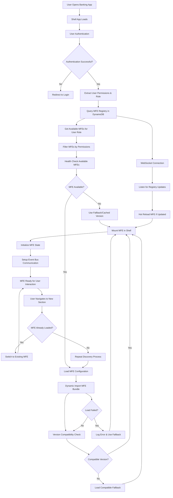
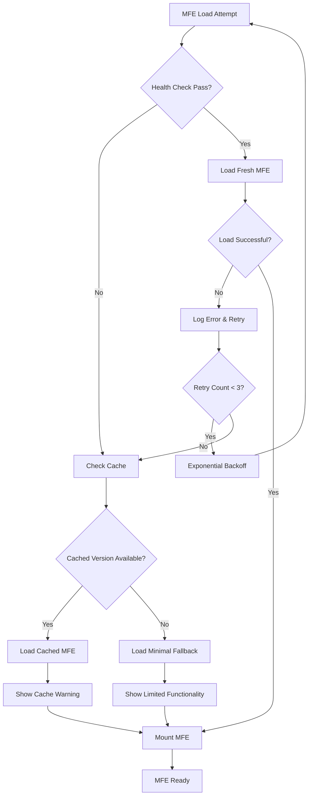

# Dynamic MFE Architecture Flowchart

## Complete Flow Diagram



## Detailed Step-by-Step Flow

### Phase 1: Initial Shell Load & Authentication
```
┌─────────────────────────────────────────────────────────────────┐
│                    Phase 1: Authentication                      │
├─────────────────────────────────────────────────────────────────┤
│ 1. User opens https://banking.company.com                      │
│ 2. Shell App loads (React bundle)                              │
│ 3. Check for existing JWT token in localStorage                │
│ 4. If no token → Redirect to ADFS SAML login                  │
│ 5. If token exists → Validate with Auth API                   │
│ 6. Extract user permissions, role, and entitlements           │
└─────────────────────────────────────────────────────────────────┘
```

### Phase 2: MFE Discovery & Registry Query
```
┌─────────────────────────────────────────────────────────────────┐
│                   Phase 2: MFE Discovery                       │
├─────────────────────────────────────────────────────────────────┤
│ 1. Query DynamoDB MFE Registry with user context              │
│    GET /api/mfe-registry?userId=123&role=premium_customer     │
│                                                                │
│ 2. Registry returns available MFEs:                           │
│    {                                                           │
│      "account_mfe": {                                          │
│        "url": "https://account.banking.com/remoteEntry.js",   │
│        "version": "2.1.0",                                    │
│        "permissions": ["account:read", "account:write"],      │
│        "healthCheck": "https://account.banking.com/health"    │
│      },                                                        │
│      "payment_mfe": { ... }                                    │
│    }                                                           │
│                                                                │
│ 3. Filter MFEs based on user permissions                      │
│ 4. Prioritize MFEs based on user's common workflows           │
└─────────────────────────────────────────────────────────────────┘
```

### Phase 3: Health Checks & Loading
```
┌─────────────────────────────────────────────────────────────────┐
│                 Phase 3: Health Check & Load                   │
├─────────────────────────────────────────────────────────────────┤
│ 1. Parallel health checks for all available MFEs              │
│    Promise.allSettled([                                        │
│      fetch('https://account.banking.com/health'),             │
│      fetch('https://payment.banking.com/health'),             │
│      fetch('https://investment.banking.com/health')           │
│    ])                                                          │
│                                                                │
│ 2. For healthy MFEs → Proceed with loading                    │
│ 3. For unhealthy MFEs → Use cached version or fallback       │
│                                                                │
│ 4. Dynamic import based on Module Federation:                 │
│    const AccountMFE = await import('account_mfe/AccountApp')   │
│                                                                │
│ 5. Version compatibility check:                               │
│    if (mfe.requiredShellVersion <= shell.version) {           │
│      mountMFE(AccountMFE)                                      │
│    } else {                                                    │
│      loadCompatibleFallback()                                  │
│    }                                                           │
└─────────────────────────────────────────────────────────────────┘
```

### Phase 4: Runtime Integration & Communication
```
┌─────────────────────────────────────────────────────────────────┐
│              Phase 4: Integration & Communication               │
├─────────────────────────────────────────────────────────────────┤
│ 1. Mount MFE in designated DOM container                      │
│    <div id="mfe-account-container"></div>                     │
│                                                                │
│ 2. Initialize shared state management:                        │
│    - Pass Redux store to MFE                                  │
│    - Setup event bus for inter-MFE communication             │
│    - Configure shared authentication context                  │
│                                                                │
│ 3. Setup real-time communication:                             │
│    - WebSocket connection for live updates                    │
│    - Server-sent events for notifications                     │
│    - Event listeners for cross-MFE messages                   │
│                                                                │
│ 4. Performance optimization:                                  │
│    - Lazy load non-critical MFE components                   │
│    - Preload likely next MFEs based on user behavior         │
│    - Cache MFE bundles in browser storage                    │
└─────────────────────────────────────────────────────────────────┘
```

## Interactive Flow Diagram (ASCII)

```
     [User] 
        │
        ▼
┌──────────────────┐
│   Shell App      │◄─── Initial Load
│   Bootstraps     │
└─────────┬────────┘
          │
          ▼
┌──────────────────┐
│  Authentication  │◄─── ADFS/SAML
│  & Authorization │
└─────────┬────────┘
          │
          ▼
┌──────────────────┐     ┌─────────────────────┐
│  MFE Registry    │────►│    DynamoDB         │
│  Query           │     │  - Available MFEs   │
└─────────┬────────┘     │  - Permissions      │
          │              │  - Health Status    │
          ▼              └─────────────────────┘
┌──────────────────┐
│  Health Checks   │
│  (Parallel)      │
└─────────┬────────┘
          │
          ▼
┌──────────────────┐     ┌─────────────────────┐
│  Dynamic Import  │────►│   Module Federation │
│  & Version Check │     │   Runtime Loading   │
└─────────┬────────┘     └─────────────────────┘
          │
          ▼
┌──────────────────┐     ┌─────────────────────┐
│   MFE Mount &    │◄────┤   Event Bus Setup   │
│   Integration    │     │   State Management  │
└─────────┬────────┘     └─────────────────────┘
          │
          ▼
┌──────────────────┐     ┌─────────────────────┐
│  User Interaction│◄────┤  Real-time Updates  │
│  & Navigation    │     │  WebSocket/SSE      │
└──────────────────┘     └─────────────────────┘
```

## Error Handling & Fallback Flow



## Key Decision Points for Expert Engineer Discussion

### 1. **Why Dynamic Discovery vs Static Configuration?**
```
Static Config Problems:
├── Shell rebuild for every MFE update
├── Tight coupling between teams
├── All-or-nothing deployments
└── Limited runtime flexibility

Dynamic Discovery Benefits:
├── Independent team deployments
├── A/B testing at MFE level
├── Graceful degradation
├── Feature flags integration
└── User-specific MFE loading
```

### 2. **Registry Design Considerations**
```
DynamoDB Schema:
┌─────────────────────────────────────────┐
│ MFE_Registry                            │
├─────────────────────────────────────────┤
│ PK: mfe_id (account_mfe)                │
│ SK: version (2.1.0)                     │
│ url: remoteEntry.js location            │
│ permissions: required permissions array │
│ healthCheck: health endpoint            │
│ compatibility: shell version matrix     │
│ metadata: deployment info, rollback     │
└─────────────────────────────────────────┘
```

### 3. **Performance Optimization Points**
```
Critical Path Optimization:
├── Preload shell dependencies (React, shared libs)
├── Parallel health checks for all MFEs
├── Browser cache for MFE bundles (versioned)
├── CDN distribution of MFE assets
└── Service worker for offline fallbacks

Loading Strategy:
├── Critical MFEs: Load immediately (account, nav)
├── Important MFEs: Load on idle (payments, transfers)
├── Optional MFEs: Load on demand (investments, loans)
└── Admin MFEs: Load only for authorized users
```

This flowchart provides a comprehensive view of the dynamic MFE architecture that you can use in your Expert Engineer interview to demonstrate deep understanding of the system's complexity and the thoughtful design decisions behind it.